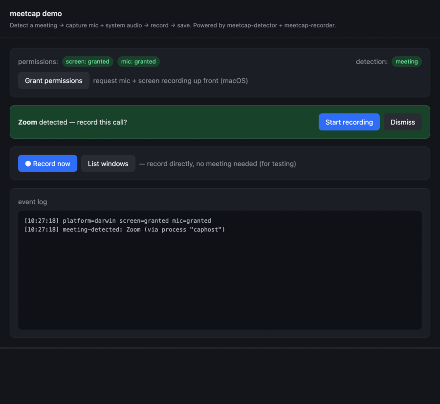

# Recording lifecycle & integration guide

How meetcap detects a meeting, records both sides of the audio, and recovers
after a crash — and exactly which events to wire. If you only read one doc
before integrating, read this one.

## The three layers

| Layer | Package | Process | Responsibility |
|---|---|---|---|
| Detector | `meetcap-main` poll → `meetcap-renderer` client | main → renderer | Is a meeting in progress? Emits `meeting-detected` / `meeting-ended`. |
| Recorder | `meetcap-renderer` (+ `meetcap-main`) | renderer capture + main disk | Capture mic + system audio, stream to disk, emit `chunk` / `complete`. |
| Bridge | `meetcap-core` | preload | `window.meetcap` IPC surface tying the two halves together. |

## Lifecycle at a glance

```
 detected            you decide to record         recording (~1s ticks)        meeting ends / Stop        finalized
 ──────────          ────────────────────         ─────────────────────        ──────────────────        ─────────
 meeting-detected →  recorder.start(meeting)   →   chunk ×N  +  stream to disk → meeting-ended→stop()   →  complete
   (prompt user)                                   (optional segmented upload)    (or manual / crash)       (filePath + segments)
```

The two events that matter most: **`meeting-detected` to begin, `meeting-ended` to wrap up.** Everything else hangs off those.

## Minimal integration

```ts
// main.ts — BEFORE app.whenReady()
import { initRecorderMain, startDetector } from 'meetcap-main'
initRecorderMain()                                   // loopback flags + recording IPC
app.whenReady().then(() => { createWindow(); startDetector({ require: 'either' }) })

// preload.ts
import { contextBridge, ipcRenderer } from 'electron'
import { exposeMeetcapBridge } from 'meetcap-core/preload'
exposeMeetcapBridge(contextBridge, ipcRenderer)      // → window.meetcap

// renderer
import { createDetectorClient, createRecorder, listInterruptedRecordings } from 'meetcap-renderer'

const detector = createDetectorClient()
const recorder = createRecorder()
let currentMeeting = null

detector.on('meeting-detected', (m) => { currentMeeting = m; recorder.start(m) })  // or prompt first
detector.on('meeting-ended',   () => { if (recorder.state === 'recording') recorder.stop() })
recorder.on('complete',        (r) => console.log('saved', r.filePath, r.segments))

// crash recovery, on launch:
listInterruptedRecordings().then((list) => { if (list.length) offerResume(list[0]) })
```

## When recording starts

Two trigger styles — pick per product:

- **Detection-driven** — start on `meeting-detected`. Auto-start (above) or, gentler, show a prompt and start on user confirm (what the demo does with its banner).
- **Manual** — call `recorder.start()` from a button, no meeting needed (the demo's **● Record now**). Good for testing and non-detected captures.

`start(meeting?, opts?)` internally: `getUserMedia(mic)` + `getDisplayMedia(loopback)` → mix via Web Audio → `openRecording` (creates/【resumes】 the manifest + a segment) → `MediaRecorder.start(timesliceMs)` → state becomes `recording`.

## When recording ends

Three paths:

1. **Meeting ended** — the detector sees the meeting window/process disappear and emits `meeting-ended` (poll-based, ~3 s latency). Wire it to `recorder.stop()`.
2. **Manual** — user hits Stop.
3. **Crash / force-quit** — `stop()` never runs. Because audio is streamed to disk, the **partial file survives** and the manifest stays `status: 'active'` (→ recoverable).

A normal `stop()`: `MediaRecorder.stop()` → flush the last chunk → drain the write chain → `closeRecording` (marks the segment closed **and the manifest `finalized`**) → fires `complete`. The difference between a clean end and a crash is simply whether the manifest got `finalized`.

## Pause / resume (within one segment) ≠ segments

Two different mechanisms, easy to conflate:

- **`pause()` / `resume()`** — mid-call hold, **same file, same segment**. Backed by `MediaRecorder.pause()/resume()`: while paused, no `chunk` events fire and nothing is written to disk, so the webm has no gap. State goes `recording → paused → recording`. The reported `durationMs` **excludes** paused time (the recorder subtracts every paused span). Use this for "hold recording" buttons.
- **Segments** — a *new* `MediaRecorder` stream → a **new file** added to the same logical recording's manifest (see below). Created by `stop()` then `start(meeting, { resumeKey })`, e.g. crash-resume. Use this when the capture genuinely restarts.

```ts
recorder.pause()    // state → 'paused'; chunks stop; file frozen
recorder.resume()   // state → 'recording'; same segment continues
// complete.durationMs is real recorded time, not wall-clock
```

## How resume works (segments)

meetcap can't append into the *same* webm file after a restart (a new `MediaRecorder` is an independent stream). Instead a **logical recording** spans multiple **segments** (one file per capture run), tied together by a sidecar manifest `<key>.meetcap.json`.

```
crash → relaunch
  → listInterruptedRecordings()            // manifests still status:'active', with their segment files
  → user clicks "Resume"
  → recorder.start(meeting, { resumeKey: rec.key })
  → main appends a NEW segment file to the SAME manifest
  → complete.segments lists every segment of the logical recording
```

Resume is **manual** (the library hands you `listInterruptedRecordings()` + `resumeKey`; it never auto-resumes). Downstream consumes the segment list — upload each part, or concatenate with a remux tool. `meeting-ended` / clean stop **finalize** a recording, so it never shows up as resumable.

## Upload: whole-file or segmented — both supported

- **Whole file** — on `complete`, read `result.filePath` and upload once. `result.segments` has every segment of the logical recording if you'd rather ship them all.
- **Segmented / streaming** — listen to `chunk` and upload each piece as it's captured:

```ts
recorder.on('chunk', ({ index, blob, mimeType }) => uploadPart(index, blob))
recorder.on('complete', (r) => finishUpload(r.recordingKey))
```

Set `createRecorder({ persistToDisk: false })` for **upload-only** (no local file, no manifest/resume — `complete.filePath` is `null`).

## Events reference

**Detector client** (`createDetectorClient()`):

| Event | Payload | Fires when |
|---|---|---|
| `meeting-detected` | `MeetingInfo` | A meeting starts (window/process matched a rule) |
| `meeting-ended` | — | The matched meeting disappears |

Also: `detector.current`, `detector.isInMeeting`.

**Recorder** (`createRecorder(options)`):

| Event | Payload | Fires when |
|---|---|---|
| `statechange` | `'idle' \| 'recording'` | Recording starts/stops |
| `chunk` | `{ index, blob, mimeType }` | Every `timesliceMs` (~1 s) — for segmented upload |
| `complete` | `RecordingResult` | After `stop()` finalizes the file |
| `error` | `unknown` | Capture/IO failure |

`RecordingResult`: `{ filePath: string \| null, recordingKey: string \| null, segments: string[], durationMs, mimeType, hasSystemAudio, meeting }`.

## `createRecorder` options

| Option | Default | Meaning |
|---|---|---|
| `filenamePrefix` | `'meetcap'` | Prefix for saved files. |
| `timesliceMs` | `1000` | Chunk/flush cadence. |
| `persistToDisk` | `true` | Stream to disk (+manifest+resume). `false` = chunk events only. |

`initRecorderMain({ saveDir, revealInFolder })` controls where files land (default `<downloads>/meetcap`) and whether to reveal in the OS file manager.

## Permissions — request up front

On macOS, recording needs **Microphone** + **Screen Recording**. If you wait until
`start()`, the first capture is blocked by a prompt — and screen recording is
worse: granting it requires an **app restart**, so that recording fails outright.

Request ahead of time (app launch / a settings screen):

```ts
import { requestPermissions, openScreenRecordingSettings, getPermissionStatus } from 'meetcap-renderer'

const status = await requestPermissions() // mic = native prompt; screen = registers the app
if (status.screen !== 'granted') {
  // Screen recording can't be granted silently — send the user to settings, then restart.
  await openScreenRecordingSettings()
}
```

- `requestPermissions()` — pops the native mic prompt and registers the app in
  System Settings → Privacy → Screen Recording. Returns the resulting `PermissionStatus`.
- `openScreenRecordingSettings()` — deep-links to that pane (no-op off macOS).
- `getPermissionStatus()` — read current status without prompting.

Built-in detection rules need no permissions and work out of the box — `startDetector()`
defaults to the `presets` (Zoom / Teams / 腾讯会议 / 飞书).

## Try it — the demo

`examples/electron-demo` wires all of the above. See it run:

```bash
pnpm demo
```

- **● Record now** — record directly, no meeting needed; watch the chunk tally in the event log, then the saved path + segments on `complete`.
- Join a Zoom meeting → the banner appears (`meeting-detected`); leaving stops it (`meeting-ended`).
- Force-quit mid-recording, relaunch → an **Interrupted recording** banner offers **Resume**.

### Walkthrough recording



📹 **Demo walkthrough** — captured from the running demo, driven over MCP via
harness-fe (the demo is instrumented in solo mode, see [debugging.md](./debugging.md)).
The asset lives in [`docs/assets/`](./assets/); to (re)capture it:

1. `pnpm demo` (the harness solo gateway auto-spawns on `127.0.0.1:47620`); reload MCP.
2. Open a real meeting (e.g. start a Zoom meeting) so the detector fires.
3. Drive the flow over MCP, screenshotting each step — **Zoom detected → Start recording
   → Pause → Resume → Stop** (or close the meeting to auto-stop) → saved `.webm`.
4. Stitch the screenshots into `docs/assets/demo-walkthrough.gif` (e.g. ImageMagick).
